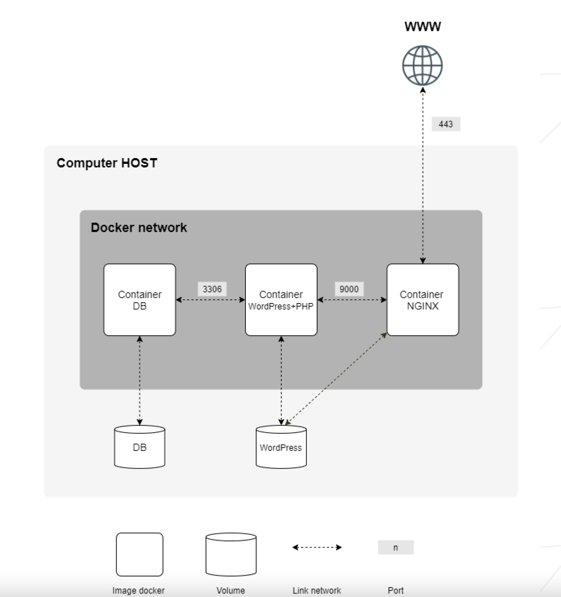

# Inception

This is an exercise on building a Docker container cluster inside a virtual machine (here, Debian 10)
using Docker, Docker-Compose and Docker Volume for data persistence.

## Description

A Docker cluster is a Wordpress website working inside a Docker Network with default options.

Backend side is a MySql Database.

Frontend side are Wordpress standard files.

.php files are processed with NGINX's FAST-CGI module with php-fpm working as a service on a separate container.

Wordpress files are changed on the basis of service_names and users inside the MySQL database.

### The resulting Docker Network will work just as described in the diagram below



### Persistent data storage

Database files are mounted into ```~/data/dbdata```

Wordpress files are mounted into ```~/data/wordpress```

## Getting Started

#### Mac OS
* Download Docker Desktop, Docker CLI or a Docker Virtual Machine
	
	[Docker Desktop download](https://docs.docker.com/desktop/mac/install/)
* ```cd``` into the root of the project
* run ```make``` 
  
#### Debian 10
* In the root folder of the project run ```bash ./srcs/debian_setup.sh```
	This will install all the necessary dependencies for Docker Engine
* ```cd``` into the root of the project
* run ```make```  


All the services are installed within the Dockerfiles.

### Executing program

* How to run the program
* Step-by-step bullets
```
code blocks for commands
```

## Help

Any advise for common problems or issues.
```
command to run if program contains helper info
```

## Authors

Contributors names and contact info

ex. Dominique Pizzie  
ex. [@DomPizzie](https://twitter.com/dompizzie)

## Version History

* 0.2
    * Various bug fixes and optimizations
    * See [commit change]() or See [release history]()
* 0.1
    * Initial Release

## License

This project is licensed under the [NAME HERE] License - see the LICENSE.md file for details

## Acknowledgments

Inspiration, code snippets, etc.
* [awesome-readme](https://github.com/matiassingers/awesome-readme)
* [PurpleBooth](https://gist.github.com/PurpleBooth/109311bb0361f32d87a2)
* [dbader](https://github.com/dbader/readme-template)
* [zenorocha](https://gist.github.com/zenorocha/4526327)
* [fvcproductions](https://gist.github.com/fvcproductions/1bfc2d4aecb01a834b46)
